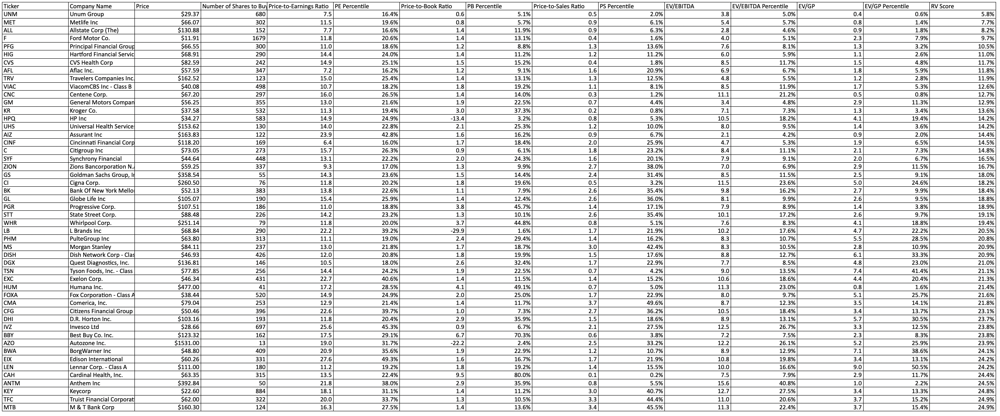

# Algorithmic Trading Based on Value Investing Principles

## Disclaimer
This is not investment advice. This program is for entertainment purposes only.

## Description
This program selects the best "value" stocks from the S&P 500 index based on a calculation of
- Price-to-Earnings (PE) ratio
- Price-to-Book (PB) ratio
- Price-to-Sales (PS) ratio
- Enterprise Value over EBITDA
- Enterprise Value over Gross Profit

## Usage
Run valueInvest.py with the command "python valueInvest.py".  

### Requirements
This program requires Python 3+.   

### Options
- Users enter portfolio value and program will adjust number of shares per ticker.
- The number of Tickers recommended can be changed.
- Users can output to Excel, output to Console, or both. 
- Users can input name of output spreadsheet.
- Users can choose column width for the output spreadsheet.
- Users can choose background and font color of the spreadsheet.

## Screenshots

