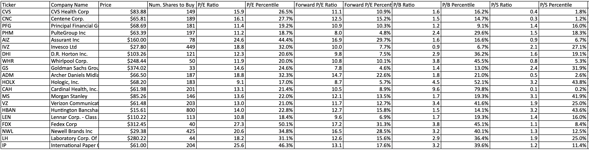
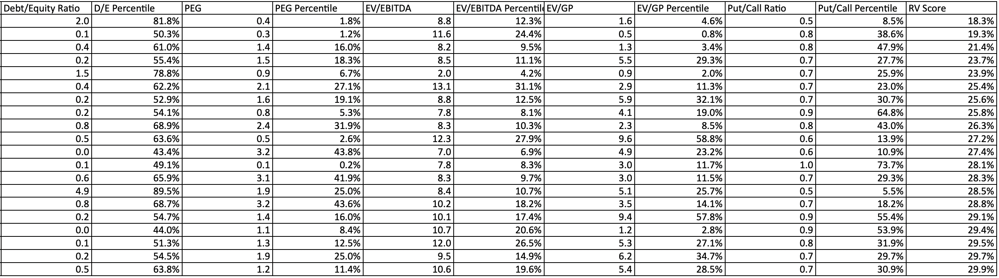

# Algorithmic Trading Based on Value Investing Principles

## Disclaimer
This is not investment advice. This program is for entertainment purposes only.

## Description
This program selects the best "value" stocks from the S&P 500 index based the following metrics to calculate a "robust value" score:
- Price-to-Earnings (P/E) ratio
- Forward P/E ratio
- Price-to-Book (P/B) ratio
- Price-to-Sales (P/S) ratio
- Debt-to-Equity (D/E) ratio
- Price-Earnings-Growth (PEG) ratio
- Enterprise Value over EBITDA (EV/EBITDA) 
- Enterprise Value over Gross Profit (EV/GP)
- Put-to-Call ratio

Stocks with negative P/E, negative forward P/E, negative P/B, or negative D/E ratios are removed from the recommendations.   
Stocks with current PE lower than forward PE (implying shrinking earnings) are also removed.

## Usage
Run valueInvest.py with the command "python valueInvest.py".  

### Requirements
This program requires Python 3+.   

### Options
- Users enter portfolio value and program will adjust number of shares per ticker.
- The number of Tickers recommended can be changed.
- Users can output to Excel, output to Console, or both. 
- Users can input name of output spreadsheet.
- Users can choose column width for the output spreadsheet.
- Users can choose background and font color of the spreadsheet.

## Screenshots

   

